# liveSubs Installation and Usage Guide

## Usage (WEB VERSION)

1. Navigate to the [web version](https://subs.puv.bar) of liveSubs (https://subs.puv.bar).
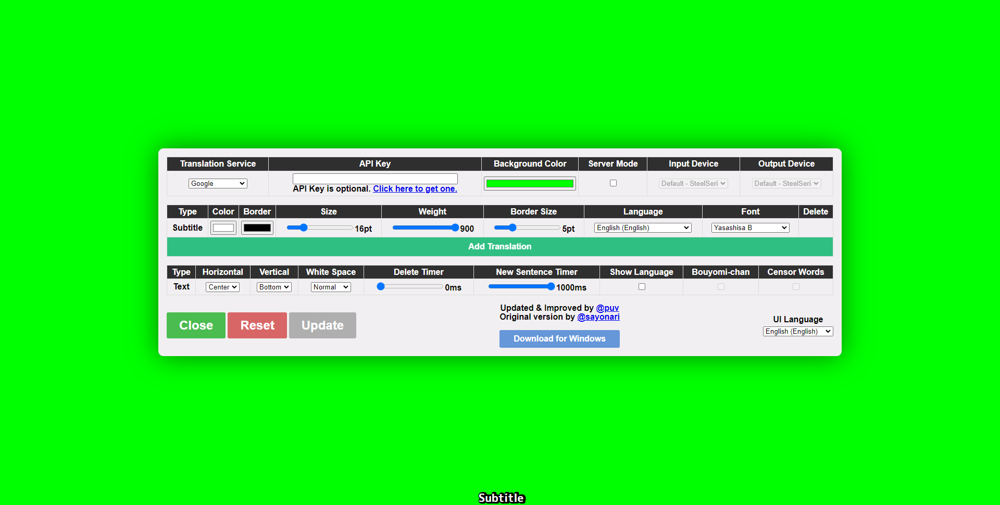

2. You should see a popup asking for permission to use your microphone. Click "Allow".
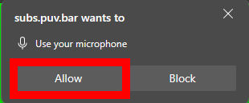

3. In the second table, select the language you will be speaking in. This will be the language that will be translated to other languages.
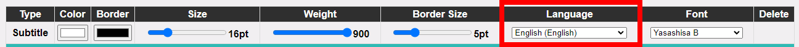

4. Add the translation options. You can add up to 5 translation options.
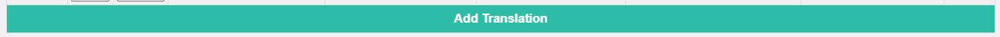

    1. Select the language for each of the translation options.
    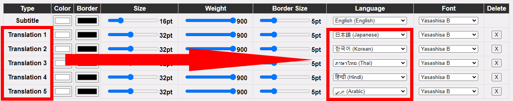

5. When you're done changing the settings, click the "Close" button.
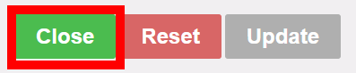

6. In the recording software of your choosing, add a new "Window Capture" source.
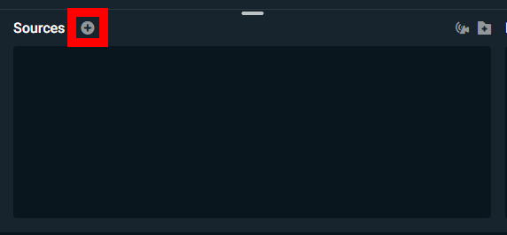
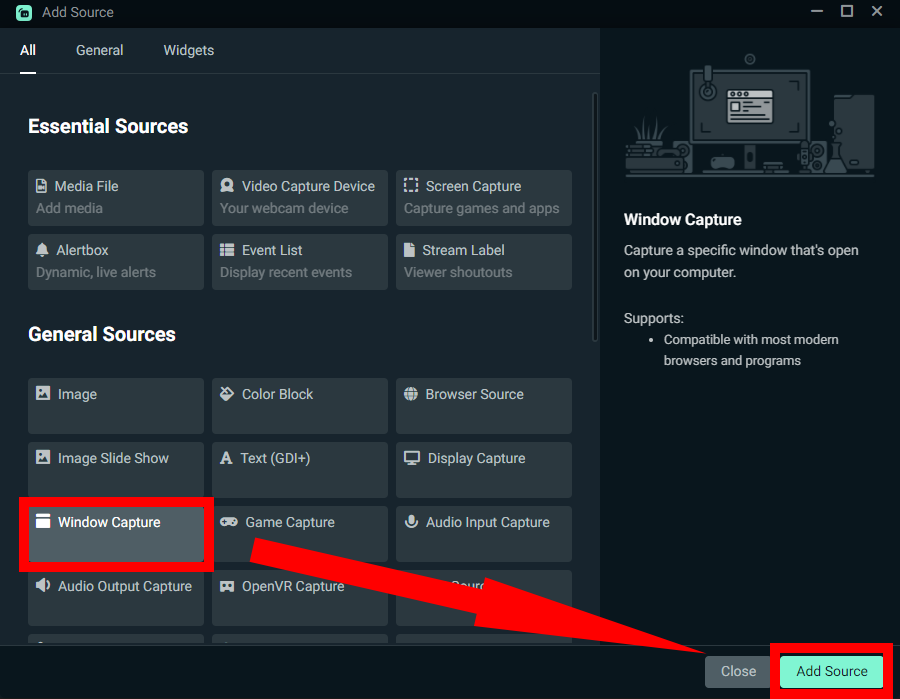

7. Select the window with the title "liveSubs" and click "OK".
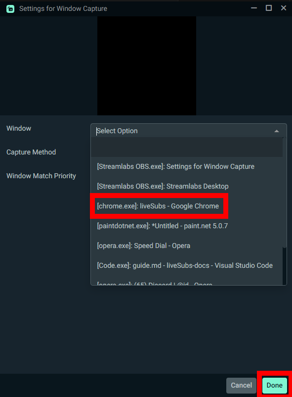

8. You should now see the subtitles in your recording software.
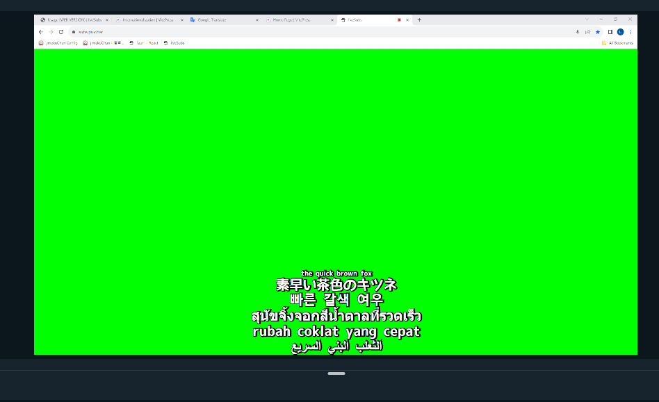 

9. Right-click the "Window Capture" source and click "Filters", "Edit Filters".
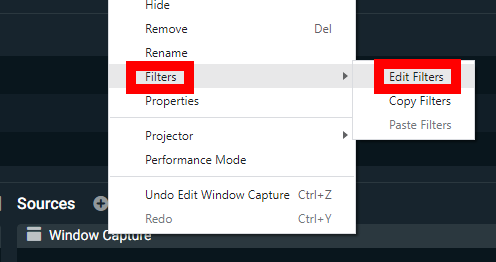

10. Click the "+" button, select "Chroma Key", and click "Add".
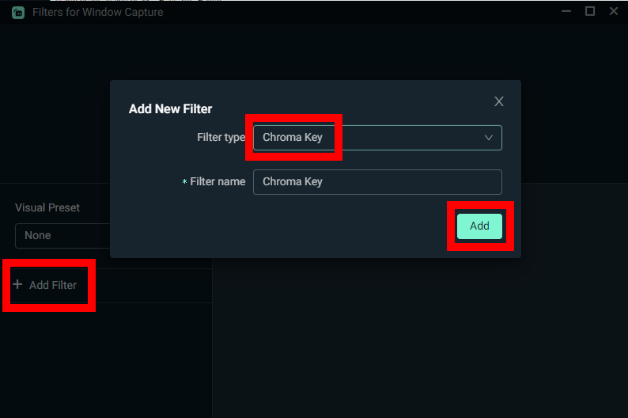

11. Click the color picker and select the color of the background of the subtitles. In this case, it's green.
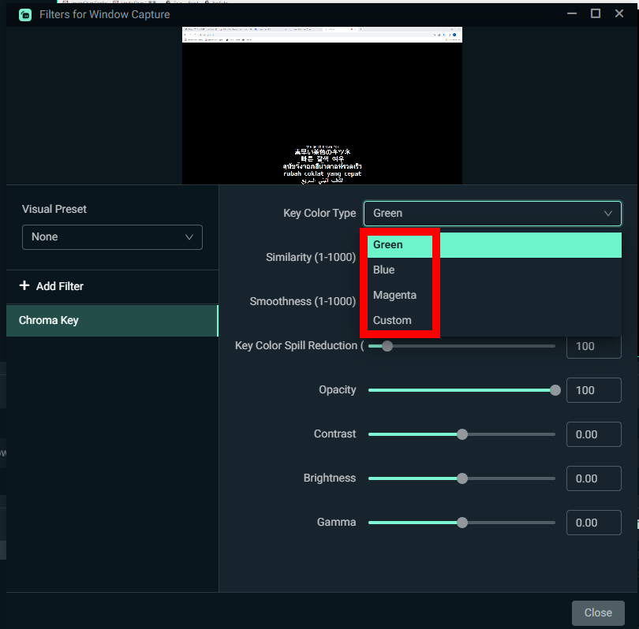

12. Click "Close".

And with that, you're done! You should now see the subtitles in your recording software without the background.
Take note, that the subtitles will not update if the window is minimized.
(If you want to fix this, you can use the [app version](#app-version) of liveSubs.)

## App Installation (WINDOWS ONLY)

1. Navigate to the [releases page](https://github.com/puv/liveSubs/releases/latest) and download the latest version of liveSubs.
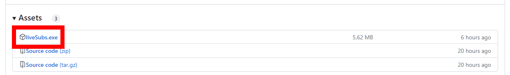

#### Because the app is not signed (which costs money), you may get a warning from your browser or Windows. This application is safe to use, and you can check the source code [here](https://github.com/puv/liveSubs).

2. If you get a warning from your browser, click "..." or "More", and then click "Keep"
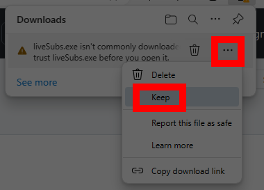
It would be very nice if you could click "Report as safe", as it would help other people who want to use liveSubs.
If asked wether you're sure, click "Keep anyway".
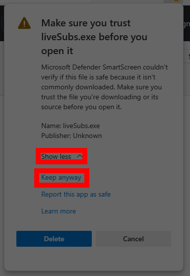

3. Open the downloaded file.

4. If you get a warning from Windows, click "More info", and then click "Run anyway".
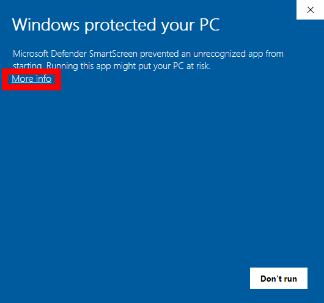
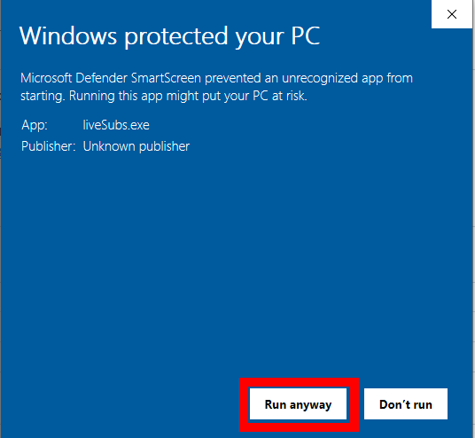

## Usage (APP VERSION)

1. Open the downloaded file.

2. You should get a popup asking for network access. Click "Allow access".
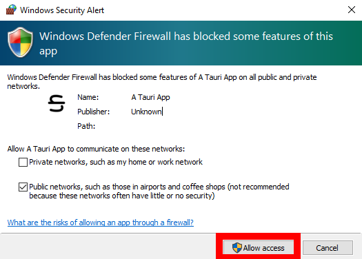

3. You should see a popup asking for permission to use your microphone. Click "Allow".

4. In the second table, select the language you will be speaking in. This will be the language that will be translated to other languages.

5. Add the translation options. You can add up to 5 translation options.

    1. Select the language for each of the translation options.
    

6. In the recording software of your choosing, add a new "Browser Source" source.

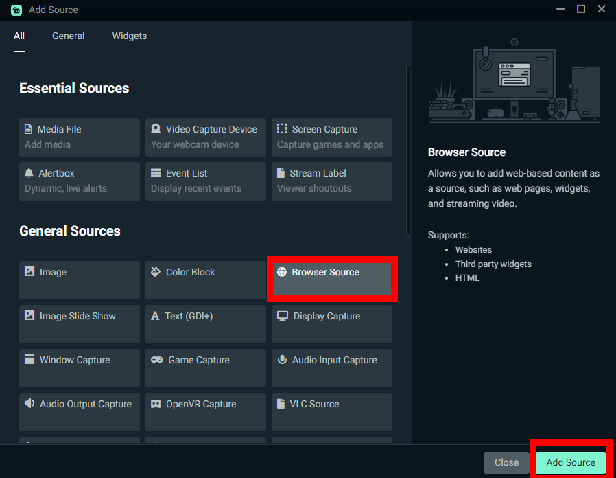

7. For the URL, write (https://subs.puv.bar/client), and click "Close".

8. You should now see the subtitles in your recording software.
 

9. Right-click the "Window Capture" source and click "Filters", "Edit Filters".

10. Click the "+" button, select "Chroma Key", and click "Add".

11. Click the color picker and select the color of the background of the subtitles. In this case, it's green.

12. Click "Close".

And with that, you're done! You should now see the subtitles in your recording software without the background.
The subtitles will update even if the window is minimized.
For future use, you only need to open the downloaded file, and everything should work.